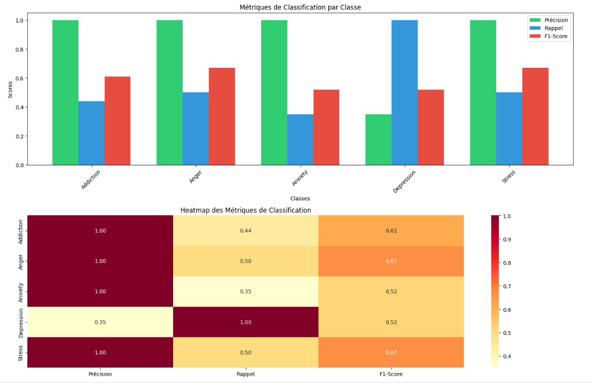
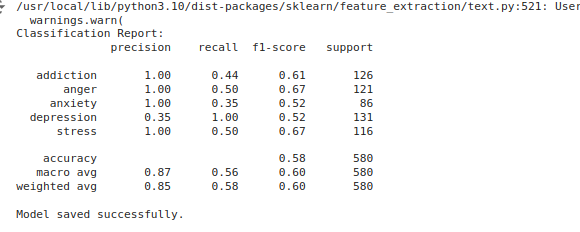

# mental-health-classifier
machine learning model to classify mental health-related conversations into different categories such as depression, anxiety, stress, anger, and addiction. 
## Training the Model

The [model_train.ipynb](model_train.ipynb) file contains the code to train the mental health conversation classifier. The main steps include:

1. Loading and preprocessing the data.
2. Defining a processing and training pipeline.
3. Training the model.
4. Evaluating the model.
5. Saving the trained model.

## Model Evaluation

The [model_evaluation_charts.ipynb](model_evaluation_charts.ipynb) file contains visualizations to evaluate the model's performance. The charts include class metrics and a confusion matrix.

### Example Chart

## Testing the Model

The [test_model.ipynb](test_model.ipynb) file contains the code to load the saved model and test it with real inputs.

## Evaluation Metrics

## Usage

1. Train the model by running the cells in the [model_train.ipynb](model_train.ipynb) notebook.
2. Evaluate the model's performance by running the cells in the [model_evaluation_charts.ipynb](model_evaluation_charts.ipynb) notebook.
3. Test the model by running the cells in the [test_model.ipynb](test_model.ipynb) notebook.
## Random Forest Classifier

A Random Forest is an ensemble learning method that operates by constructing multiple decision trees during training and outputting the mode of the classes (classification) or mean prediction (regression) of the individual trees. It is known for its robustness and ability to handle large datasets with higher dimensionality.

## Training Process

1. **Load and Preprocess Data**: Load the dataset and filter the relevant labels.
2. **Custom Tokenizer**: Define a custom tokenizer using spaCy for text cleaning and tokenization.
3. **Pipeline Setup**: Create a pipeline with TfidfVectorizer and RandomForestClassifier.
4. **Train-Test Split**: Split the data into training and testing sets.
5. **Model Training**: Train the Random Forest model.
6. **Model Evaluation**: Evaluate the model using classification metrics.

## spaCy and `en_core_web_sm`

[spaCy](https://spacy.io/) is an open-source library for advanced natural language processing in Python. It is designed specifically for production use and provides a fast and efficient way to process large volumes of text.

The `en_core_web_sm` model is a small English language model provided by spaCy. It includes vocabulary, syntax, and entities, and is used for tasks such as tokenization, part-of-speech tagging, and named entity recognition.

## Tokenization

Tokenization is the process of breaking down text into individual tokens, which can be words, phrases, or other meaningful elements. In this project, we use spaCy to tokenize the text, lemmatize the tokens, and remove stopwords and non-alphabetic tokens.
